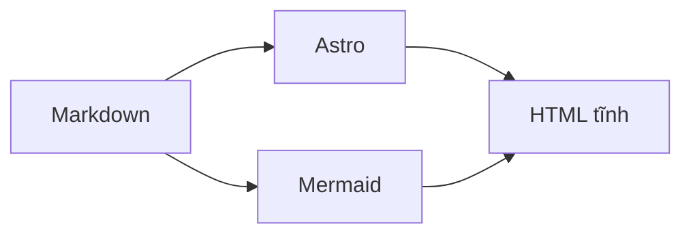

Đây là bài mẫu để bạn thấy **Markdown** và định dạng hiển thị ra sao.

## Vì sao dùng repo này?

- Nội dung nằm trong `src/content/blog/` — chỉ cần thêm file `.md` là có bài mới.
- Build ra HTML tĩnh, deploy lên bất kỳ host nào.
- Khối code có nút **Copy** (giống ý tưởng ghi chú IT, dán vào Slack/IDE nhanh).

## Sơ đồ Mermaid (tuỳ chọn)

Trong Markdown dùng fence `mermaid`:



Đổi **giao diện sáng/tối** (nút góc phải trên): sơ đồ tự render lại cho khớp theme.

## Đoạn code mẫu

```bash
# chạy local
npm install
npm run dev
```

```ts
// vite/astro env
const ok = import.meta.env.PROD ? "production" : "dev";
console.log(ok);
```

> **Ghi chú:** Paste từ VS Code hay terminal vào đây vẫn ổn — ưu tiên đọc trên web hoặc sửa trực tiếp file Markdown.

## Checklist nhanh

- [x] Static data
- [x] Copy code
- [ ] Thêm bài của bạn

Chúc viết vui.
