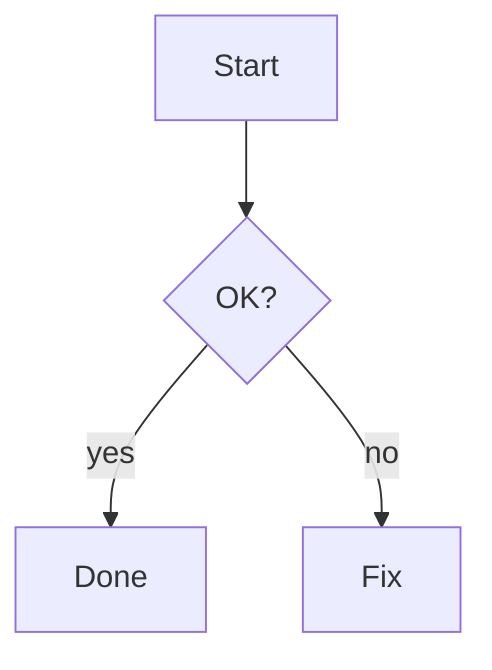
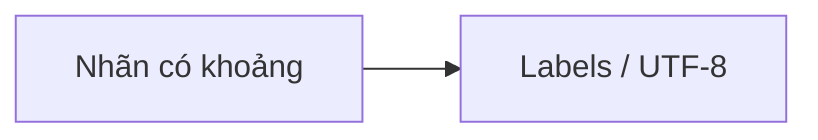

File này là **bảng tra cứu** khi viết bài trong `src/content/blog/`. Bạn có thể nhân bản cấu trúc và xoá phần ví dụ không cần.

## Frontmatter (bắt buộc & tuỳ chọn)

Mọi bài là file `.md` với khối YAML ở đầu file (giữa `---`).

| Trường | Bắt buộc | Ý nghĩa |
|--------|----------|---------|
| `title` | Có | Tiêu đề hiển thị, tab trình duyệt, RSS |
| `description` | Có | Mô tả ngắn (SEO, Open Graph) |
| `pubDate` | Có | Ngày xuất bản — dùng `YYYY-MM-DD` hoặc ISO |
| `tags` | Không | Mảng string, nhãn nhỏ dưới tiêu đề bài (`[]` nếu trống) |
| `category` | Không | Nhóm lớn trên sidebar / «Theo danh mục» |
| `subcategory` | Không | Nhóm con (collapsible). Không ghi thì bài nằm trực tiếp dưới `category` |
| `draft` | Không | `true` = chỉ thấy khi `npm run dev`; `npm run build` ẩn bài |
| `updatedDate` | Không | Hiện thêm dòng «cập nhật …» dưới ngày đăng |

**URL bài** lấy theo **tên file** (slug): ví dụ `huong-dan-soan-bai-markdown.md` → `/blog/huong-dan-soan-bai-markdown/`.

Ví dụ tối thiểu:

```yaml
---
title: "Tiêu đề bài"
description: "Một câu mô tả cho SEO."
pubDate: 2026-05-16
tags: ["thẻ-a", "thẻ-b"]
category: "Tên category"
subcategory: "Tên sub (tuỳ chọn)"
draft: false
---
```

## Tiêu đề & đoạn văn

Dùng `#` … `######` cho heading. Astro tự tạo **id** (slug) cho heading để neo link (ví dụ `#frontmatter-bắt-buộc--tuỳ-chọn`).

**In đậm / in nghiêng / gạch giữa** (GitHub Flavored Markdown — GFM):

**đậm**, *nghiêng*, ***đậm và nghiêng***, ~~gạch ngang~~.

## Liên kết & hình ảnh

- Markdown: `[text](https://example.com)` — mở tab hiện tại hoặc tải.
- GFM **autolink**: chèn trực tiếp `https://example.com` cũng thành link (tùy trình xử lý).

**Ảnh tĩnh** đặt trong thư mục `public/`, rồi tham chiếu từ gốc site:

```markdown

```

(Ví dụ file `public/screenshot.png` → ``.)

## Danh sách

- Không thứ tự: dấu `-`, `*`, hoặc `+`.
- Có thứ tự: `1.` `2.` …
- **Task list** (GFM):

- [ ] Việc chưa xong
- [x] Việc đã xong

## Trích dẫn & gạch ngang

> Trích dẫn: dùng `>` đầu dòng.
> Nhiều dòng vẫn nằm trong cùng blockquote.

Ngăn cách bằng đường kẻ ngang:

---

(Ký tự `---` trên dòng riêng.)

## Code: inline & khối

Inline: `` `npm run dev` ``.

Khối code có **tô màu** (Shiki, theme `github-dark` khi build):

```bash
echo "shell"
```

```ts
const x: string = "TypeScript";
```

```json
{ "a": 1 }
```

Trên trang đọc: **hover** khối code để thấy nút **Copy**; trên cảm ứng nút luôn hiện.

## Mermaid (sơ đồ)

Dùng fence với ngôn ngữ `mermaid`. Blog sẽ thay khối bằng SVG; đổi **sáng/tối** (góc phải màn hình) sẽ vẽ lại cho khớp theme.

````markdown

````

**Mẹo:** Nhãn có khoảng trắng, dấu đặc biệt hoặc tiếng Việt nên bọc trong **dấu ngoặc kép**:



Các loại diagram khác (sequence, class, state, …) xem [tài liệu Mermaid](https://mermaid.js.org/).

## Bảng (GFM)

| Cột A | Cột B |
|-------|-------|
| a1    | b1    |
| a2    | b2    |

Căn chỉnh cột bằng dấu `:` trong hàng phân cách nếu cần (chuẩn GFM), ví dụ `| :--- | ---: |`.

## HTML thô (tuỳ chọn)

Astro Markdown cho phép nhúng HTML trong bài (rehype-raw), ví dụ:

<kbd>Ctrl</kbd> + <kbd>S</kbd>

Dùng vừa đủ; ưu tiên Markdown khi có thể.

## «Smarty pants» (dấu câu typographic)

remark-smartypants có thể đổi `...` thành dấu elision, ngoặc kép thông minh, v.v. tùy nội dung — thường chỉ ảnh hưởng nhẹ khi gõ trong editor.

## Trên trang bài: nút Copy & breadcrumb

- **Copy text** / **Copy rich**: copy **toàn bộ** phần nội dung chính (plain hoặc HTML — dán sang Word/Notion thường giữ dạng tốt hơn).
- **Breadcrumb** trên cùng: Trang chủ · `category` · `subcategory` (nếu có).

## Draft & build

| Lệnh | Bài `draft: true` |
|------|-------------------|
| `npm run dev` | Vẫn xem được (để soạn thử) |
| `npm run build` | Không xuất bản, không vào RSS/sitemap |

## Checklist nhanh trước khi đăng

- [ ] `title`, `description`, `pubDate` đã đủ
- [ ] `draft: false` (hoặc bỏ hẳn trường này)
- [ ] Đã kiểm tra link, ảnh `public/`, và Mermaid (nếu có)
- [ ] Chạy `npm run build` rồi `npm run preview` để xem bản giống production

---

*Bạn có thể bookmark trang này (slug `huong-dan-soan-bai-markdown`) khi soạn bài mới.*
